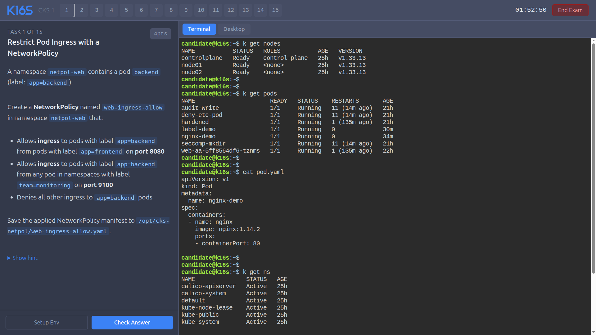
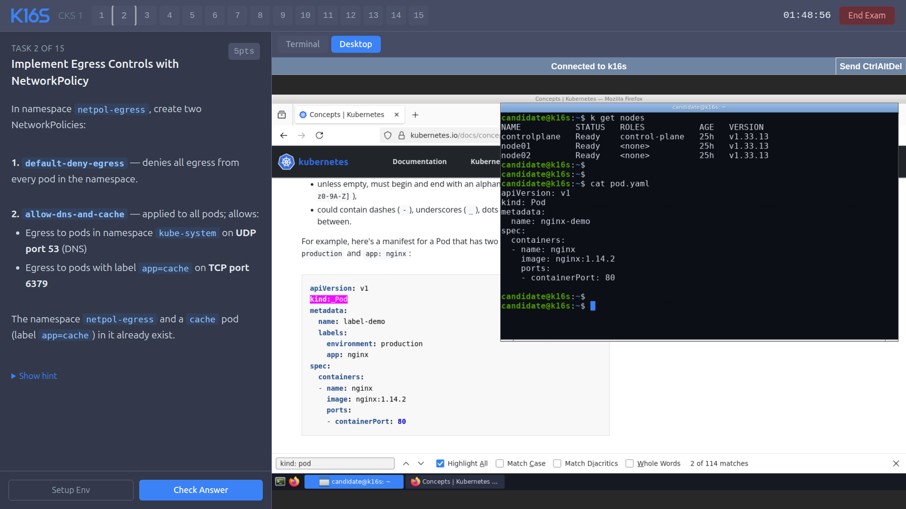

# K16S - Kubernetes Exam Simulator

A self-hosted CKA and CKS exam simulator that runs a **real kubeadm cluster** on any Linux VPS — or entirely on your own laptop, no VPS required.
One command to provision. Browser-based terminal. Timed mock exams with per-question setup and automated validation.

---

## Why K16S

Most Kubernetes practice labs run [kind](https://kind.sigs.k8s.io/) (Kubernetes-in-Docker) or lightweight k3s clusters. Both have real limitations for exam prep:

- `kind` runs all nodes as containers inside a single Docker daemon, no real node isolation, no `systemctl`, no kubelet config files, no `crictl`
- k3s omits many kubeadm-specific workflows entirely (cluster init, etcd backup, certificate management, static pod manifests)

**K16S uses a real kubeadm-provisioned cluster with [Incus](https://linuxcontainers.org/incus/) LXC containers as worker nodes.** Each worker is a full Linux system with its own init, systemd, containerd, and kubelet. This matches what the actual CKA/CKS exam environment runs.

| Feature | kind / k3d | K16S |
|---|---|---|
| Real kubeadm cluster | ✗ | ✓ |
| `systemctl` on workers | ✗ | ✓ |
| Worker node kubelet config | ✗ | ✓ |
| etcd backup/restore | limited | ✓ |
| Static pod manifests | limited | ✓ |
| `crictl` debugging | ✗ | ✓ |
| Per-question setup + grading | ✗ | ✓ |

---

## What's Included

### CKA - Certified Kubernetes Administrator

Two full mock exams, 18 questions each, covering the [official 2026 CKA curriculum](https://training.linuxfoundation.org/certification/certified-kubernetes-administrator-cka/).

**CKA Mock 1** - core administration workflows:
- Troubleshooting: NotReady node, CrashLoopBackOff, Pending pod, broken scheduler, top resource consumers
- Cluster architecture: etcd backup, node drain, RBAC (Role + RoleBinding), certificate expiry, static pod
- Networking: NetworkPolicy, Gateway API, Ingress, CoreDNS stub zone
- Workloads: HPA, DaemonSet, sidecar + shared volume
- Storage: PersistentVolume + PVC + Pod

**CKA Mock 2** - advanced and 2026-updated topics:
- Troubleshooting: broken kube-apiserver manifest, OOMKilled pod, wrong Service selector, ResourceQuota blocking pods, cluster event investigation
- Cluster architecture: ClusterRole + ClusterRoleBinding, kubeconfig for a ServiceAccount, manual pod scheduling, Kustomize overlay
- Workloads: PriorityClass, Job + CronJob, Secret as env vars and volume
- Networking: headless Service + StatefulSet DNS, egress NetworkPolicy with DNS exception, named container ports + NodePort
- Storage: default StorageClass, recovering a Released PersistentVolume, Helm install without CRDs

### CKS - Certified Kubernetes Security Specialist

Three full mock exams, 18 questions each, covering the [official 2026 CKS curriculum](https://training.linuxfoundation.org/certification/certified-kubernetes-security-specialist-cks/).

Topics across the three mocks: NetworkPolicy (ingress, egress, ipBlock, namespaceSelector, matchExpressions), AppArmor profile loading and pod annotation, seccomp profiles (RuntimeDefault, Localhost, audit), CIS benchmark with kube-bench, API server hardening, kubelet hardening, etcd certificate authentication, PKI (key generation, CSR signing, certificate inspection, SAN).

---

## Requirements

**VPS mode:**
- A VPS or VM running **Debian 13** (trixie) or **Ubuntu 22.04+**
- Minimum: **4 vCPUs, 8 GB RAM, 30 GB disk**
- Root SSH access
- Open port **80** (the exam UI is served over plain HTTP on the LAN, not intended for public internet exposure)

**Laptop mode:**
- macOS or Linux, **16 GB+ RAM** recommended (the VM takes 8 GB, leave headroom for everything else you run)
- [Lima](https://lima-vm.io) (`brew install lima` on macOS, `apt install lima` or a release binary on Linux)
- Windows isn't supported natively yet — WSL2 users can follow the Linux path, but it's unverified

---

## Quick Start

### Option A — on your laptop (no VPS, no cloud bill)

```bash
git clone https://github.com/immanuwell/k16s-exam-simulator.git
cd k16s-exam-simulator
bash install.sh --laptop
```

This boots a disposable Ubuntu VM with [Lima](https://lima-vm.io) and runs the exact same provisioner inside it — same kubeadm cluster, same Incus worker nodes, same exam server. Your actual laptop OS is never touched; everything lives inside the VM's disk image. When done, open `http://localhost:8080/`.

The VM defaults to 1 worker node and no web desktop (leaner than the VPS profile, since this shares your laptop with everything else you're running) — pass `--desktop`, `--workers 2`, `--cpus`, `--memory`, or `--disk` to change that.

Once created, manage the environment with `local/k16s-local`:

```bash
local/k16s-local stop      # suspend the VM, free up RAM/CPU, state preserved
local/k16s-local start     # resume where you left off
local/k16s-local status    # VM state + exam UI / terminal URLs
local/k16s-local ssh       # shell into the VM (add --root for sudo -i)
local/k16s-local logs      # tail the exam server's logs
local/k16s-local reset     # wipe the cluster and re-provision from scratch
local/k16s-local destroy   # delete the VM entirely
```

See [`local/lima.yaml`](local/lima.yaml) for the VM template and [`local/k16s-local`](local/k16s-local) for the full command reference.

### Option B — on a VPS or VM

```bash
git clone https://github.com/immanuwell/k16s-exam-simulator.git
cd k16s-exam-simulator
bash install.sh --host <your-vm-ip>
```

That's it. The provisioner:
1. Installs containerd, kubeadm, kubelet, kubectl on the host
2. Runs `kubeadm init` and sets up Calico CNI
3. Creates Incus LXC worker containers and joins them to the cluster
4. Installs ttyd (web terminal) and nginx (reverse proxy)
5. Deploys the K16S exam server with all question banks

When done, open `http://<your-vm-ip>/` in a browser.

Re-running `install.sh` is safe, every step is idempotent.

---

## How It Works

**Selecting an exam:** choose a profile (CKA 1, CKA 2, CKS 1, CKS 2, CKS 3) and a duration (30 min / 2 h / 3 h), then click **Start Exam**.

**Setup Env:** clicking this button for a question runs a `setup.sh` script on the cluster that puts the environment into the expected broken or incomplete state, exactly like the real exam's pre-configured scenario.

**Check Answer:** runs a `validate.sh` script that inspects the cluster state and returns `PASS` or `FAIL` with a specific reason. Validation is done against the actual Kubernetes API and filesystem state, not just YAML syntax.

**Terminal:** a full `bash` session on the controlplane node, accessible at `/terminal/`. `kubectl`, `helm`, `etcdctl`, and `crictl` are all available. Workers are reachable via `ssh node01` / `ssh node02`.

---

## Architecture

```
Browser
  │
  ▼ :80
nginx (host)
  ├── /           → K16S exam server  :8080
  └── /terminal/  → ttyd              :7681

Host VM  (Debian 13, kubeadm controlplane)
  ├── node01  (Incus LXC, Debian 12, kubelet + containerd)
  └── node02  (Incus LXC, Debian 12, kubelet + containerd)
```

- **Kubernetes:** v1.33.x via kubeadm
- **CNI:** Calico (VXLAN, supports NetworkPolicy)
- **Metrics:** [metrics-server](https://github.com/kubernetes-sigs/metrics-server), so `kubectl top nodes`/`kubectl top pods` work out of the box
- **Worker nodes:** Incus LXC containers with full systemd, `/dev/kmsg`, and containerd
- **Terminal:** [ttyd](https://github.com/tsl0922/ttyd) running as `root` on the controlplane
- **Exam server:** Go binary + SvelteKit frontend, reads question YAML files from disk at startup

**Laptop mode** is the identical stack above, just relocated: instead of a cloud VPS, the "Host VM" is a local [Lima](https://lima-vm.io) VM (Ubuntu 24.04) managed by `local/k16s-local`, with nginx's port 80 forwarded to `localhost:8080` on your machine. Nothing about the controlplane/worker split, kubeadm, or Incus changes — it's the same real cluster, just running on your hardware instead of rented hardware.

---

## Adding Custom Questions

Each question is a YAML file plus two bash scripts:

```
exams/<profile>/
  01-my-question.yaml          # id, title, weight, context, description, hint
  scripts/01-my-question/
    setup.sh                   # puts the cluster in the broken/incomplete state
    validate.sh                # checks the cluster; exits 0 (PASS) or 1 (FAIL)
```

After adding files, re-run `bash install.sh --host <ip>` to sync and restart the server. No rebuild needed.

---

## License

[PolyForm Noncommercial 1.0.0](LICENSE) — free for personal and non-commercial use; commercial use (including SaaS or paid services built on top of this) requires a separate agreement.
